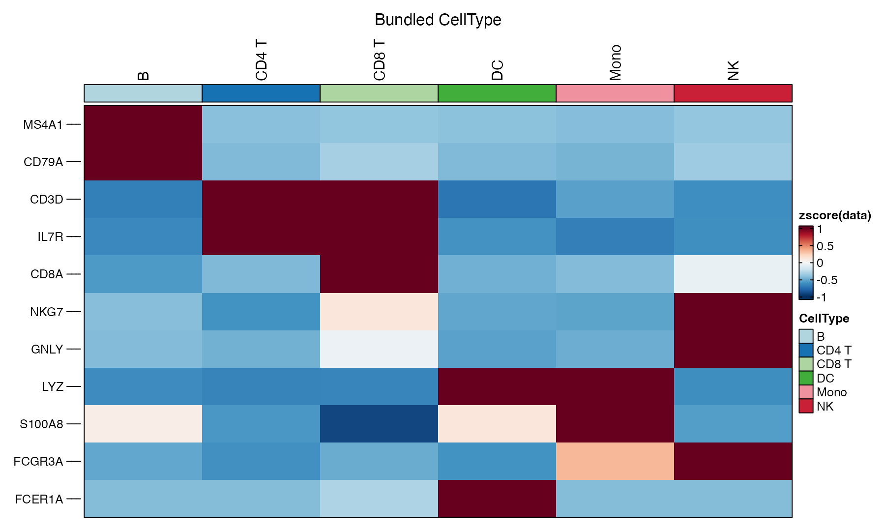

The executed case uses `pbmcmultiome_sub`: 500 real PBMCs with RNA and peak assays, balanced across six broad bundled classes.

## A practical evidence ladder

1. **Cluster markers and canonical markers** establish a tissue-aware baseline.
2. **Reference transfer** asks whether a labelled reference can explain the query.
3. **A pretrained classifier** supplies an independent model vocabulary and confidence.
4. **Consensus review** resolves conflicts, mixed identities, rare populations, and unknowns.

## Manual marker evidence

```r
data(pbmcmultiome_sub, package = "scop")
DefaultAssay(pbmcmultiome_sub) <- "RNA"
srt <- NormalizeData(pbmcmultiome_sub)

markers <- c(
  "MS4A1", "CD79A",        # B
  "CD3D", "IL7R", "CD8A",# T
  "NKG7", "GNLY",         # NK
  "LYZ", "S100A8", "FCGR3A", # monocytes
  "FCER1A"                 # dendritic
)
DotPlot(srt, features = markers, group.by = "CellType")
```

{fig-alt="Dot plot shows canonical immune marker expression across B, CD4 T, CD8 T, dendritic, monocyte, and NK classes."}

Marker evidence is contextual. `NKG7` alone does not separate NK from cytotoxic T cells; `LYZ` alone does not resolve monocyte and dendritic states.

## RNA-to-RNA reference transfer

For generic RNA reference mapping, use Seurat anchors. The executed test stratified the real PBMC object into 302 reference cells and 198 held-out query cells:

```r
anchors <- FindTransferAnchors(
  reference = reference,
  query = query,
  reference.reduction = "pca",
  dims = 1:15
)
pred <- TransferData(
  anchorset = anchors,
  refdata = reference$CellType,
  dims = 1:15
)
query <- AddMetaData(query, pred)
```

Held-out accuracy against the bundled broad labels was **93.43%**, with mean maximum prediction score **0.9027**. This is a within-dataset method check and will overestimate performance on a truly independent cohort.

`scop::RunLabelTransfer()` is aimed at a `ChromatinAssay`/multiome transfer path. Do not call it as though it were a generic RNA-to-RNA wrapper.

## CellTypist through SCOP

```r
srt <- RunCellTypist(
  srt,
  assay = "RNA",
  layer = "data",
  model = "Immune_All_Low.pkl",
  majority_voting = FALSE
)
table(srt$celltypist_predicted_labels)
summary(srt$celltypist_conf_score)
```

The real run matched 5,361 genes and produced 19 fine immune labels with median confidence **0.9977**. The fine model vocabulary is not one-to-one with the six broad bundled classes, so this site does not manufacture a forced accuracy score.

## SingleR

```r
# requires SingleR plus an appropriate reference, often from celldex
srt <- RunSingleR(srt, reference = reference_object, label = "label.main")
```

`SingleR` and `celldex` were absent from the audited runtime; no result is claimed here. Installing a package is not the same as selecting a biologically appropriate reference.

## Resolve conflicts explicitly

Keep columns such as:

```r
srt$annotation_manual
srt$annotation_transfer
srt$annotation_celltypist
srt$annotation_final
srt$annotation_confidence
srt$annotation_note
```

Prefer `uncertain_T_NK`, `mixed`, or `unknown` over a false precise label. Validate final labels with markers, abundance, tissue context, cluster coherence, and doublet flags.
