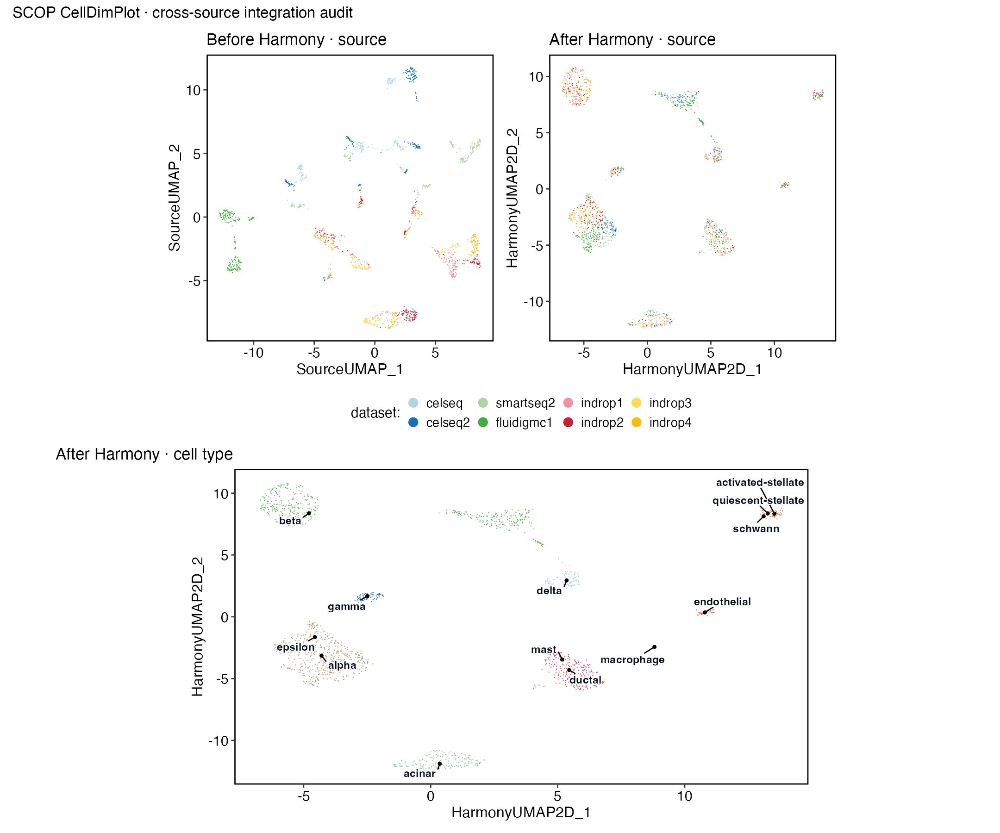

“Many objects” can mean biological replicates from one study, technical libraries from one donor, or unrelated public datasets. The code may begin with `merge()`, but the supported conclusion is completely different. This chapter keeps those designs separate.

::: {.learning-objectives}
## Learning outcomes

You will learn to:

1. construct and validate a sample sheet before reading matrices;
2. run QC and doublet calling per biological sample;
3. preserve patient, sample, condition, batch, technology, and dataset identities;
4. decide among merge, Harmony, CCA, RPCA, scVI, or reference mapping;
5. detect condition–batch confounding before integration;
6. validate technical mixing and biological preservation quantitatively;
7. return to raw counts for sample-level pseudobulk inference.
:::

## Biological question

Which variation is plausibly technical, which is biological, and can integration reduce the former while preserving the latter? This question is answerable only after sample identity, independent experimental units, condition, batch, technology, and dataset source have been locked.

## 1 · Identify the design you actually have

| Design | Independent unit | Typical goal | What integration can do | What it cannot do |
|---|---|---|---|---|
| several patients/animals in one study | patient or animal | estimate a condition effect | reduce unwanted technical variation | create missing biological replication |
| several libraries from one sample | sample, not library | improve coverage or check technical consistency | align library effects | turn libraries into patients |
| several public datasets | study/dataset | construct an atlas or map shared states | harmonise shared populations | remove protocol–biology confounding |
| reference plus query | query sample | transfer labels or position a query | map into a reference space | make the reference an experimental control |

No bundled SCOP teaching object in the audited runtime contains a replicated condition-by-patient study. Therefore the biological multi-sample code below is a complete design template, while the executed `panc8_sub` evidence is explicitly a **technical cross-source integration case**.

## 2 · Build and lock the sample sheet {#biological-multi-sample-design}

::: {.input-contract}
**Minimum sample-sheet contract**

| Field | Meaning | Must be unique? |
|---|---|---|
| `sample_id` | independent library/sample identifier | yes |
| `patient_id` | donor/animal identifier | no if repeated measures exist |
| `condition` | primary biological contrast | no |
| `batch` | unwanted processing batch | no |
| `dataset` | source study | no |
| `technology` | 10x v2/v3, Smart-seq2, etc. | no |
| `file_path` | input location | yes per row |
| `species` / `genome` | reference identity | no |
:::

```r
samples <- read.csv("sample-sheet.csv", stringsAsFactors = FALSE)

required <- c(
  "sample_id", "patient_id", "condition", "batch",
  "dataset", "technology", "file_path", "species", "genome"
)
stopifnot(all(required %in% colnames(samples)))
stopifnot(!anyDuplicated(samples$sample_id))
stopifnot(all(file.exists(samples$file_path)))

with(samples, table(condition, batch))
with(samples, table(patient_id, condition))
```

If every case was processed in batch A and every control in batch B, the design is confounded. No integration algorithm can identify which difference is condition and which is batch. Stop, obtain additional data, or narrow the claim.

## 3 · Read and audit each sample separately

```r
objects <- lapply(seq_len(nrow(samples)), function(i) {
  counts <- Read10X(samples$file_path[i])
  if (is.list(counts)) counts <- counts[["Gene Expression"]]

  x <- CreateSeuratObject(
    counts,
    project = samples$sample_id[i],
    min.cells = 0,
    min.features = 0
  )

  x$sample_id <- samples$sample_id[i]
  x$patient_id <- samples$patient_id[i]
  x$condition <- samples$condition[i]
  x$batch <- samples$batch[i]
  x$dataset <- samples$dataset[i]
  x$technology <- samples$technology[i]
  x
})
names(objects) <- samples$sample_id
```

Before QC, create a per-sample audit table:

```r
input_audit <- do.call(rbind, lapply(names(objects), function(id) {
  x <- objects[[id]]
  data.frame(
    sample_id = id,
    genes = nrow(x),
    cells = ncol(x),
    total_umi = sum(GetAssayData(x, assay = "RNA", layer = "counts")),
    duplicate_genes = anyDuplicated(rownames(x)),
    duplicate_cells = anyDuplicated(colnames(x))
  )
}))
input_audit
```

Different gene identifier versions, species, genome builds, or feature types must be reconciled before merge. Never intersect features silently: report original features, mapped features, shared features, one-to-many mappings, and discarded features.

## 4 · Perform QC per sample

```r
objects <- lapply(objects, function(x) {
  x[["percent.mt"]] <- PercentageFeatureSet(x, pattern = "^MT-")

  x <- RunCellQC(
    x,
    assay = "RNA",
    split.by = NULL,
    return_filtered = FALSE,
    qc_metrics = c("doublets", "outlier", "umi", "gene", "mito"),
    db_method = "scDblFinder",
    UMI_threshold = 1000,
    gene_threshold = 500,
    mito_threshold = 20,
    seed = 20260807
  )
  x
})
```

The numeric thresholds above are placeholders that must be replaced after plotting sample-wise distributions. A study-level retention table should contain input cells, each exclusion reason, unique excluded cells, retained cells, retention percentage, median genes/UMIs/mitochondrial percentage, and QC status.

```r
retention <- do.call(rbind, lapply(names(objects), function(id) {
  md <- objects[[id]][[]]
  data.frame(
    sample_id = id,
    input_cells = nrow(md),
    doublets = sum(md$db_qc == "Fail", na.rm = TRUE),
    qc_pass = sum(md$CellQC == "Pass", na.rm = TRUE)
  )
}))
```

In SCOP 0.8.9 with the requested metrics, `db_qc` and `CellQC` are factors with `Pass`/`Fail` levels. Inspect `table(md$db_qc, md$CellQC, useNA = "ifany")` after a version change. A sample that loses 80% of cells is a study-level warning that must remain visible.

::: {.checkpoint}
**Checkpoint 1 — per-sample QC**

Save one QC-complete RDS per sample plus one combined retention table. Do not merge first and attempt to reconstruct per-sample exclusions later.
:::

## 5 · Merge without erasing identity

```r
srt <- merge(
  objects[[1]],
  y = objects[-1],
  add.cell.ids = names(objects)
)
srt <- JoinLayers(srt)

stopifnot(all(c(
  "sample_id", "patient_id", "condition", "batch",
  "dataset", "technology"
) %in% colnames(srt[[]])))

table(srt$sample_id, srt$condition)
```

Merge means “put cells in one object”; it does not mean “remove batch”. For a well-balanced study, first construct an uncorrected representation and inspect whether correction is needed.

## 6 · Choose normalization and integration

```r
srt <- SCTransform(
  srt,
  assay = "RNA",
  new.assay.name = "SCT",
  vst.flavor = "v2",
  variable.features.n = 2000,
  verbose = FALSE
)
```

| Method | Prefer when | Main risk | Required check |
|---|---|---|---|
| no integration | one balanced technology or biological differences dominate | residual technical variation | sample mixing within matched cell types |
| `Harmony_integrate()` | shared populations and an explicit unwanted batch/source | overcorrection | preserve condition and marker structure |
| `CCA_integrate()` | correlated shared structure across related datasets | forcing weakly shared populations | anchor coverage and rare-cell retention |
| `RPCA_integrate()` | related larger datasets needing conservative anchors | undercorrection | residual source structure |
| `scVI_integrate()` | enough cells and a justified nonlinear model | backend/version sensitivity | held-out and biology-preservation metrics |
| reference mapping | stable atlas plus new query | reference vocabulary bias | unknown/low-score query cells |

Example Harmony call:

```r
srt <- Harmony_integrate(
  srt_merge = srt,
  batch = "batch",
  assay = "SCT",
  normalization_method = "SCT",
  do_normalization = FALSE,
  do_HVF_finding = FALSE,
  HVF = VariableFeatures(srt),
  do_scaling = FALSE,
  linear_reduction_dims = 30,
  linear_reduction_dims_use = 1:20,
  harmony_dims_use = 1:20,
  cluster_resolution = 0.4,
  seed = 20260807
)
```

Do not use `condition` as the Harmony batch variable when condition is the biological effect of interest.

## 7 · Executed cross-source case {#cross-source-integration}

`panc8_sub` contains **1,600 pancreatic cells**, exactly 200 from each of eight public dataset sources spanning five technologies.

```r
data(panc8_sub, package = "scop")
cross <- JoinLayers(panc8_sub)

cross <- SCTransform(
  cross,
  assay = "RNA",
  new.assay.name = "SCT",
  vst.flavor = "v2",
  variable.features.n = 2000,
  verbose = FALSE
)

cross <- Harmony_integrate(
  srt_merge = cross,
  batch = "dataset",
  assay = "SCT",
  normalization_method = "SCT",
  do_normalization = FALSE,
  do_HVF_finding = FALSE,
  HVF = VariableFeatures(cross),
  do_scaling = FALSE,
  linear_reduction_dims = 30,
  linear_reduction_dims_use = 1:20,
  harmony_dims_use = 1:20,
  nonlinear_reduction = "umap",
  cluster_resolution = 0.4,
  seed = 20260807
)
```

Use SCOP for the pre/post panels:

```r
CellDimPlot(
  cross,
  group.by = c("dataset", "celltype"),
  reduction = "HarmonyUMAP2D",
  show_stat = FALSE,
  raster = FALSE
)
```

{fig-alt="SCOP panels compare source separation before Harmony, source mixing after Harmony, and known cell-type structure after Harmony."}

::: {.scop-native}
**SCOP-native figure provenance:** all three panels come from `scop::CellDimPlot()` on the real `panc8_sub` checkpoint. Patchwork only arranges the SCOP-returned plots.
:::

## 8 · Validate both correction and preservation

For each cell, the evidence builder compares its 20 nearest neighbours before and after Harmony:

| Metric | Before | After | Desired direction |
|---|---:|---:|---|
| neighbours from another technical source | 0.2169 | **0.6765** | increase when source is unwanted |
| neighbours with the same bundled cell type | 0.9379 | **0.9616** | remain high |
| cluster-majority agreement with bundled cell type | — | **0.9681** | remain high |

This combination supports better technical mixing while preserving the known cell-type structure in this example. It does not prove that every biological signal is preserved. For a new study also compare condition separation within matched cell types, canonical marker expression, rare populations, cluster sizes, sample entropy, and differential-expression sensitivity.

Reject or narrow an integration when:

- a biological condition is confounded with batch;
- markers disappear or unrelated cell types merge;
- rare populations vanish;
- quantitative mixing improves only because all structure collapses;
- the method cannot be rerun from a versioned checkpoint.

## 9 · Composition and pseudobulk after integration

Use the integrated reduction for neighbours and visualization. Use raw RNA counts for sample-level inference.

```r
counts <- GetAssayData(srt, assay = "RNA", layer = "counts")

aggregate_key <- interaction(
  srt$sample_id,
  srt$cell_type,
  drop = TRUE
)

pseudobulk <- t(rowsum(t(as.matrix(counts)), group = aggregate_key))
```

The design matrix must use biological samples or patients:

```r
design <- model.matrix(~ batch + condition, data = pseudobulk_metadata)
```

For composition with biological replicates, SCOP provides:

```r
srt <- RunPropeller(
  srt,
  group.by = "cell_type",
  split.by = "condition",
  sample.by = "sample_id",
  comparison = c("case", "control"),
  seed = 20260807
)
```

Do not use cell count as the replicate count. The real `panc8_sub` pseudobulk demonstration aggregates `dataset × celltype`; because dataset labels are technical sources, it validates a method path but does not support population-level disease inference.

## 10 · Outputs and failure diagnosis

Save:

- the immutable sample sheet and its hash;
- one QC checkpoint per sample;
- retention and exclusion tables;
- merged pre-integration and post-integration objects;
- feature-mapping report;
- pre/post SCOP figures;
- mixing and biology-preservation metrics;
- pseudobulk count matrix and design matrix;
- session information and manifest.

| Failure | Likely evidence | Decision |
|---|---|---|
| one sample dominates all clusters | cell counts and retention table | downsampling can aid plots, but cannot repair a failed sample |
| batches remain separated | matched-cell-type plots | may be true biology or insufficient overlap; do not force mixing |
| cell types collapse after correction | markers and preservation score | reduce correction or reject the method |
| design matrix is singular | `condition × batch` table | stop inferential modelling |
| pseudobulk has one sample per group | sample count | report descriptive results only |
| genes disappear after merge | feature mapping report | repair identifiers and rebuild from sample checkpoints |

::: {.exercise}
## Practice task

For a hypothetical six-sample study, create a sample sheet with three cases and three controls across two balanced batches. Then create a deliberately confounded version. Show the two `condition × batch` tables and explain why no Harmony parameter can repair the confounded design.
:::

::: {.boundary}
The eight `panc8_sub` source labels are technical datasets, not eight patients. They validate an integration workflow and known-cell-type preservation; they cannot support a patient, population, or disease effect.
:::
