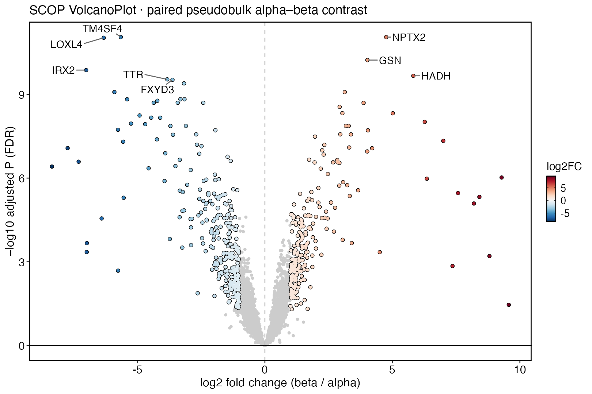

高级分析不是功能菜单。每个模块必须先定义生物学问题、实验单位、必要输入和停止规则。本章明确区分**已经在真实数据上执行的路径**与**尚缺 study design 或可选 backend 的扩展模板**。

::: {.learning-objectives}
## 学习目标

你将学会：

1. 区分 cluster markers 与 sample-level differential expression；
2. 构建 pseudobulk counts，并用 SCOP `VolcanoPlot()` 展示有效结果；
3. 根据问题选择 over-representation、GSEA 或 composition test；
4. 选择 trajectory 方法而不把 ordering 写成 lineage proof；
5. 把 communication、SCENIC、metabolism、CNV 和 Scissor 写成可验证假设；
6. 将模块连接成一条论文主线，而不是堆砌互不相关的图。
:::

## 1 · 先锁定问题与独立实验单位

::: {.input-contract}
**研究级推断的输入合同**

- 原始 counts 仍然可用；
- `sample_id` 表示独立生物学样本；
- `condition` 包含预先规定的比较；
- `cell_type` 来自已审核注释，并保留不确定性；
- 每个 condition 有生物学重复；
- 配对、batch、sex、age 等 covariates 在拟合前编码；
- 技术来源演示不能写成 patient-level inference。
:::

| 问题 | 必须重复的单位 | 主要结果 | SCOP runner / plotter |
|---|---|---|---|
| 某 cell type 哪些基因改变？ | 生物学样本 | pseudobulk coefficient、uncertainty、FDR | 外部 count model → `VolcanoPlot()` |
| 显著基因概括为什么过程？ | 继承 DEG design | enriched terms | `RunEnrichment()` → `EnrichmentPlot()` |
| 完整排序中哪些 pathway 改变？ | 继承 DEG design | enrichment score / FDR | `RunGSEA()` → `GSEAPlot()` |
| 哪些 cell populations 比例改变？ | 生物学样本 | log-fold difference / FDR | `RunPropeller()` 或 `RunProportionTest()` → `ProportionTestPlot()` |
| 是否存在连续转变？ | 适当设计中的 cells | connectivity / pseudotime | `RunPAGA()`、`RunCytoTRACE()`、`RunSlingshot()` 及 plotters |
| 有哪些 ligand–receptor 假设？ | 最好有重复样本 | sender–receiver candidates | `RunCellChat()` → `CCCNetworkPlot()` / `CCCHeatmap()` |
| 哪些调控 programme 不同？ | 足够 gene coverage | regulon activity | `RunSCENIC()` → `SCENICPlot()` |
| 哪些代谢 programme 不同？ | 足够 gene coverage | relative pathway score | `RunMetabolism()` → `MetabolismPlot()` |
| 哪些细胞有 CNV-like expression？ | tumour cells + 正常 reference | expression-derived CNV | `RunCNV()` → `CNVPlot()` |
| 哪些单细胞与 bulk phenotype 相关？ | 匹配的 bulk cohort | Scissor+/Scissor− candidates | `RunScissor()` → `ScissorPlot()` |

## 2 · 已执行的 pseudobulk 差异表达

真实演示使用 `panc8_sub`，按 `dataset × CellType` 聚合 raw counts，并在八个技术 dataset sources 内配对比较 beta 与 alpha。它可以验证 count model 与 SCOP 绘图路径；这些 source 不是患者。

```r
library(scop)
library(Seurat)
library(edgeR)

data(panc8_sub, package = "scop")
srt <- panc8_sub
DefaultAssay(srt) <- "RNA"

keep <- srt$celltype %in% c("alpha", "beta")
counts <- LayerData(srt, assay = "RNA", layer = "counts")[, keep]
meta <- srt[[]][keep, c("dataset", "celltype"), drop = FALSE]
meta$pseudo_id <- paste(meta$dataset, meta$celltype, sep = "__")

pseudobulk <- rowsum(
  t(as.matrix(counts)),
  group = meta$pseudo_id,
  reorder = FALSE
)
pseudobulk <- t(pseudobulk)

sample_table <- unique(meta[c("pseudo_id", "dataset", "celltype")])
sample_table <- sample_table[match(colnames(pseudobulk), sample_table$pseudo_id), ]
stopifnot(identical(colnames(pseudobulk), sample_table$pseudo_id))
```

大型研究应使用 sparse-aware 聚合，避免 `as.matrix()`。这里仅为了在 1,600-cell 教学子集上明确 grouping contract。

```r
y <- DGEList(pseudobulk)
keep_gene <- filterByExpr(y, group = sample_table$celltype)
y <- calcNormFactors(y[keep_gene, , keep.lib.sizes = FALSE])

design <- model.matrix(~ dataset + celltype, data = sample_table)
y <- estimateDisp(y, design)
fit <- glmQLFit(y, design, robust = TRUE)
test <- glmQLFTest(fit, coef = "celltypebeta")
deg <- topTags(test, n = Inf)$table

volcano_input <- transform(
  deg,
  feature = rownames(deg),
  avg_log2FC = logFC,
  p_val = PValue,
  p_val_adj = FDR
)
```

```r
VolcanoPlot(
  srt = srt,
  res = volcano_input,
  DE_threshold = "abs(avg_log2FC) >= 1 & p_val_adj < 0.05",
  x_metric = "avg_log2FC",
  y_metric = "p_val_adj",
  nlabel = 10,
  label.by = "p_val_adj",
  verbose = FALSE
)
```

{fig-alt="SCOP VolcanoPlot 展示八个配对技术来源中 beta 对 alpha 的 pseudobulk 差异基因。"}

::: {.scop-native}
**SCOP 原生图片证据：**`scop::VolcanoPlot()` 绘制来自真实 `panc8_sub` counts 的 edgeR pseudobulk 结果；graphics device 只保存 SCOP 返回的图片。
:::

实际运行测试 **5,227 genes**，其中 **527** 个满足 FDR < 0.05 且 |log2 fold change| ≥ 1。这证明 beta-versus-alpha programme 强且管线可执行；因为八个来源不是独立患者，它不估计疾病或治疗效应。

::: {.checkpoint}
**检查点 1——差异模型**

保存 count aggregation 规则、pseudobulk sample table、design matrix、contrast、保留基因、normalization factors、完整结果、绘图阈值、session information，以及真实实验单位声明。
:::

## 3 · 富集：gene list 还是完整 ranking？

有合理显著列表时使用 over-representation；完整方向性排序有意义时使用 GSEA。不要只按 adjusted P 排序，应使用带方向的 effect/statistic。

```r
significant_genes <- rownames(deg)[deg$FDR < 0.05 & abs(deg$logFC) >= 1]

enriched <- RunEnrichment(
  geneID = significant_genes,
  species = "Homo_sapiens",
  db = "GO_BP"
)

EnrichmentPlot(
  res = enriched,
  db = "GO_BP",
  plot_type = "dot",
  padjustCutoff = 0.05,
  topTerm = 10
)
```

```r
ranked_statistic <- setNames(deg$F, rownames(deg))
ranked_statistic <- sort(ranked_statistic[is.finite(ranked_statistic)], decreasing = TRUE)

gsea <- RunGSEA(
  geneID = names(ranked_statistic),
  geneScore = unname(ranked_statistic),
  species = "Homo_sapiens",
  db = "GO_BP"
)

GSEAPlot(
  res = gsea,
  db = "GO_BP",
  plot_type = "bar",
  direction = "both",
  padjustCutoff = 0.05
)
```

必须检查 identifier conversion、database version、background universe、term redundancy、leading-edge genes，以及 pathway 是否只由一个大基因家族推动。富集只总结输入统计量，不直接测量 pathway activity 或因果机制。

## 4 · 细胞组成分析

先建立明确的 sample design：

```r
sample_design <- unique(srt[[]][c("sample_id", "condition", "patient_id", "batch")])
stopifnot(!anyDuplicated(sample_design$sample_id))
table(sample_design$condition)

srt <- RunPropeller(
  srt,
  group.by = "cell_type",
  split.by = "condition",
  sample.by = "sample_id",
  comparison = c("treated", "control"),
  n_bootstrap = 1000,
  seed = 20260807
)
```

也可以显式指定 SCOP proportion method：

```r
srt <- RunProportionTest(
  srt,
  group.by = "cell_type",
  split.by = "condition",
  comparison = c("treated", "control"),
  sample.by = "sample_id",
  proportion_method = "propeller",
  FDR_threshold = 0.05,
  seed = 20260807
)

ProportionTestPlot(
  srt,
  comparison = c("treated", "control"),
  proportion_method = "propeller",
  plot_type = "effect"
)
```

检查 absolute counts、denominator、缺失群体、compositional dependence 和 sample exclusion sensitivity。若每组只有一个样本，必须停止推断：cells 不能制造 biological replication。

## 5 · 轨迹与 dynamics {#trajectory-and-dynamics}

只有连续生物过程合理且被采样时才做 trajectory。`pancreas_sub` 含 RNA、spliced 和 unspliced assays，适合教学 dynamics-aware 决策。

```r
srt <- RunPAGA(
  srt = srt,
  assay_x = "RNA",
  layer_x = "counts",
  group.by = "annotation_final",
  linear_reduction = "pca",
  nonlinear_reduction = "umap",
  use_rna_velocity = FALSE,
  infer_pseudotime = TRUE,
  root_group = "progenitor",
  backend = "cpp"
)

PAGAPlot(
  srt,
  type = "connectivities",
  reduction = "umap",
  edge_threshold = 0.05,
  label = TRUE
)
```

Root 必须由生物学、采样时间或正交证据支持，不能选择最漂亮方向。

```r
srt <- RunCytoTRACE(srt)
CytoTRACEPlot(srt, reduction = "umap", group.by = "annotation_final")

srt <- RunSlingshot(
  srt,
  group.by = "annotation_final",
  reduction = "umap",
  start = "progenitor",
  seed = 20260807
)
```

SCOP 也导出 `RunPalantir()`、`RunMonocle2()` 和 `RunMonocle3()`。RNA velocity 扩展可用 `RunSecActVelocity()` 与 `VelocityPlot()`；审计的 0.8.9 runtime **没有**导出 `RunVelocity()`。用已知 markers、time points 和方法敏感性比较 branches。Pseudotime 是 ordering model，不是直接观察某个细胞转变为另一个细胞。

## 6 · 细胞通讯

```r
srt <- RunCellChat(
  srt,
  group.by = "annotation_final",
  species = "Homo_sapiens",
  split.by = "condition",
  assay = "RNA",
  layer = "data",
  min.cells = 10,
  backend = "cpp"
)

CCCNetworkPlot(
  srt,
  method = "CellChat",
  plot_type = "circle",
  display_by = "aggregation",
  group.by = "annotation_final"
)

CCCHeatmap(
  srt,
  method = "CellChat",
  plot_type = "bubble",
  sender.use = "macrophage",
  receiver.use = "T_cell"
)
```

必须审核 ligand/receptor expression、group size、database/species、重复 condition comparison、annotation uncertainty，以及可能的空间或蛋白支持。表达推断的 edge 只是候选，不证明 ligand secretion、receptor activation、physical contact 或 functional signalling。

## 7 · 调控与代谢 programme

### SCENIC

```r
srt <- RunSCENIC(
  srt,
  assay = "RNA",
  layer = "counts",
  species = "Homo_sapiens",
  ranking_dbs = ranking_database_files,
  motif_annotations = motif_annotation_file,
  backend = "cpp",
  cores = 4,
  seed = 20260807,
  work_dir = "artifacts/scenic"
)

SCENICPlot(
  srt,
  group.by = "annotation_final",
  plot_type = "rss_heatmap",
  top_n = 12
)
```

记录 genome build、motif database files、species、regulators、backend、seed 和 work directory。Regulon activity 是模型 programme，不是直接 TF binding 证据。

### Metabolism

```r
srt <- RunMetabolism(
  srt,
  assay = "RNA",
  group.by = "annotation_final",
  layer = "counts",
  db = "KEGG",
  species = "Homo_sapiens",
  method = "AUCell",
  backend = "cpp",
  seed = 20260807
)

MetabolismPlot(
  srt,
  group.by = "annotation_final",
  plot_type = "heatmap"
)
```

检查 library-size/cell-state confounding 与 pathway gene coverage。Relative transcript score 不是 metabolite concentration 或 metabolic flux。

## 8 · 恶性与 phenotype association

### Expression-derived CNV

```r
srt <- RunCNV(
  srt,
  method = "copykat",
  assay = "RNA",
  layer = "counts",
  group.by = "annotation_final",
  reference.by = "annotation_final",
  reference = c("T_cell", "B_cell", "endothelial"),
  genome = "hg38",
  sample.by = "sample_id",
  output_dir = "artifacts/cnv"
)

CNVPlot(
  srt,
  plot_type = "heatmap",
  method = "copykat",
  group.by = "annotation_final"
)
```

正常 reference 必须有依据且不含疑似恶性细胞。用 DNA、病理、已知 tumour markers 或其他正交数据验证。CNV-like expression 不能独立作为临床恶性诊断。

### Scissor phenotype association

```r
srt <- RunScissor(
  srt,
  bulk_dataset = bulk_expression,
  phenotype = phenotype_vector,
  assay = "RNA",
  bulk_assay = "counts",
  layer = "counts",
  family = "binomial",
  backend = "cpp",
  cutoff = 0.2,
  seed = 20260807
)

ScissorPlot(
  srt,
  plot_type = "umap",
  reduction = "umap",
  group.by = "annotation_final"
)
```

拟合前必须对齐 bulk samples、phenotype values、feature IDs、方向与 covariates。与 bulk phenotype 的关联不证明所选 cells 导致 phenotype。

## 9 · 建立一条论文主线

常见且可辩护的链条是：

> replicated population change → sample-level expression programme → enrichment → 一个 candidate regulator/interaction → orthogonal 或 spatial validation

| 箭头 | 最低授权证据 | 停止规则 |
|---|---|---|
| composition → DEG | 重复样本且每类细胞足够 | sample-level counts 不足 |
| DEG → enrichment | 稳定 ranking 与 ID mapping | contrast 不稳定或 mapping 失败 |
| enrichment → mechanism | coherent leading-edge genes | term 被 artefact/redundancy 驱动 |
| mechanism → communication/regulation | 匹配状态和 prerequisites | 缺 backend/reference 或生物学矛盾 |
| single-cell → spatial validation | 兼容组织/condition 和 coordinate QC | 数据集不可比较 |

::: {.checkpoint}
**检查点 2——高级分析包**

每个保留模块保存：科学问题、input checkpoint hash、函数与完整参数、backend/database versions、完整结果表、SCOP 原生图片、sensitivity analysis，以及一句“该结果不能证明什么”。
:::

## 常见失败

| 现象 | 原因 | 处理 |
|---|---|---|
| 每组一个样本却有极小 DEG P 值 | cells 被当作 replicates | 停止推断；增加重复或标为 descriptive |
| 出现成千上万通用富集 term | universe、冗余或 gene list 有问题 | 修正 ID/universe 并检查 leading edge |
| 稀有 cell type 比例显著 | denominator 不稳或 counts 太低 | 查看逐样本 counts 和敏感性 |
| 换 root 后轨迹反向 | root 无生物学锚定 | 报告不确定性或停止方向解释 |
| communication network 到处稠密 | 阈值低、标签太宽或 database effect | 缩小问题并验证表达/重复 |
| SCENIC/metabolism 跟随 library size | 技术混杂 | 检查 depth correlation 和 matched comparison |
| 免疫细胞被 CNV 判为 malignant | reference 污染/无效或技术偏差 | 重建 reference 并要求正交验证 |
| 可选 runner 在 setup 失败 | 缺数据库、Python/R backend 或 genome resource | 记录 `not executed`，不发布 placeholder |

::: {.exercise}
## 练习

为自己的研究写一份高级分析 specification：生物学问题、独立实验单位、object fields、runner、plotter、预期结果表、一个 sensitivity test、一个 stopping rule，以及允许写出的最强结论。若没有 biological replication，请改写为 descriptive analysis。
:::

::: {.boundary}
本章只有 beta-versus-alpha pseudobulk 结果及其 SCOP `VolcanoPlot()` 是已执行证据。其余代码是经过 SCOP 0.8.9 版本核对的模板；在目标研究上真正验证 prerequisites、backend、result object 和 plot 前，不能描述为已经完成。
:::
