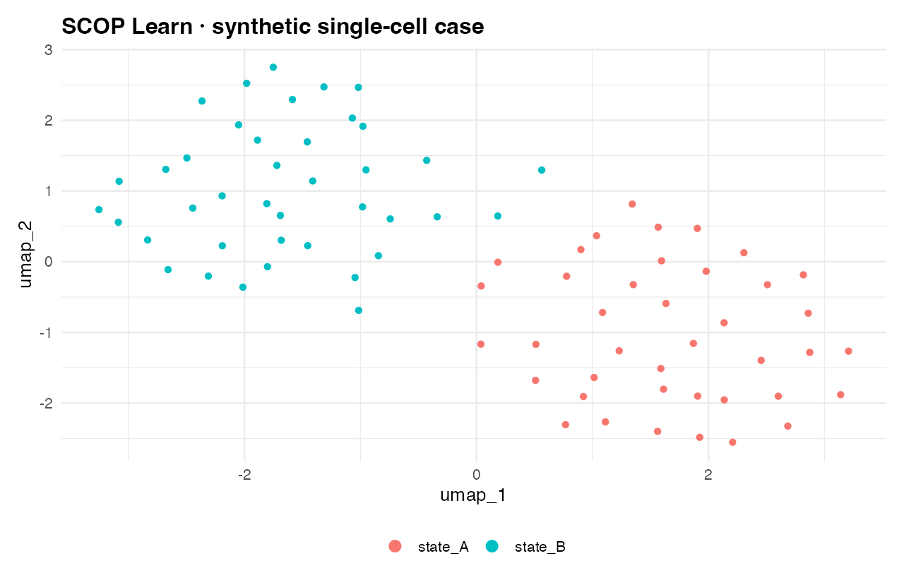

<span class="version-chip">已执行：SCOP 0.8.9 · R 4.5.1 · 合成输入</span>

## 生物学原理

我们使用一个带有两个明确状态的合成计数矩阵。目的在于展示工作流接口和证据记录，不是模拟患者队列或建立生物学发现。

## 输入契约

- 120 个基因 × 80 个细胞。
- 一个 RNA assay 和两个明确分组。
- 含有状态相关 marker 信号的合成 counts。
- 不作患者、临床或治疗解释。

## 工作流

```r
library(Seurat)
library(scop)

srt <- CreateSeuratObject(counts, project = "scop-learn-single-cell")
srt$group <- group
srt <- RunCellQC(srt, qc_metrics = c("umi", "gene"), UMI_threshold = 0, gene_threshold = 0, verbose = FALSE)
srt <- NormalizeData(srt, verbose = FALSE)
srt <- FindVariableFeatures(srt, nfeatures = 60, verbose = FALSE)
srt <- ScaleData(srt, features = VariableFeatures(srt), verbose = FALSE)
srt <- RunPCA(srt, features = VariableFeatures(srt), npcs = 12, verbose = FALSE)
srt <- FindNeighbors(srt, dims = 1:8, verbose = FALSE)
srt <- FindClusters(srt, resolution = 0.4, verbose = FALSE)
srt <- RunUMAP(srt, dims = 1:8, verbose = FALSE)
estimated_dims <- RunDimsEstimate(srt, reduction = "pca", reduction_method = "scree", verbose = FALSE)
```

完整执行脚本在[仓库中](https://github.com/Carl6231/scop-learn/blob/main/scripts/single-cell-case.R)，会写出证据记录和下方图形。

{fig-alt="按声明状态着色的两个合成状态 UMAP" fig-cap="该图是工作流检查点，不是生物学发现；输入和输出身份在证据清单中记录。"}

## 预期洞察

- 有意使用宽松 QC 后，对象保留 80 个细胞和 120 个基因。
- 声明的分组信号在低维视图中仍然可见。
- SCOP 维度估计返回建议范围，不代替检查 scree 行为或为研究选择维度。
- 证据清单记录了生成图形时使用的包和运行时身份。

## 解释边界

两个颜色是写入合成矩阵的标签，不是发现出来的细胞类型、治疗效应或患者群体证据。案例展示的是如何构建和检查工作流，不是如何从任意 cluster 产生结论。

## 审阅清单

- 检查 QC 阈值和保留细胞数。
- 检查输入 PCA 的 assay 和 feature。
- 检查邻居和 UMAP 使用的维度。
- 判断 cluster 身份是否有声明标签或外部证据支持。
- 在修改工作流前保存证据清单。

[证据清单](../evidence/single-cell-case.json) · [复现策略](reproducibility.html)
