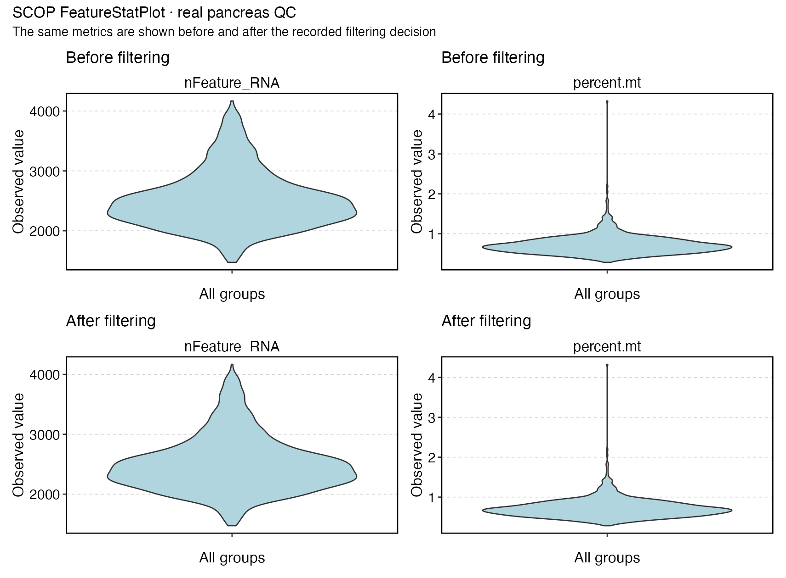
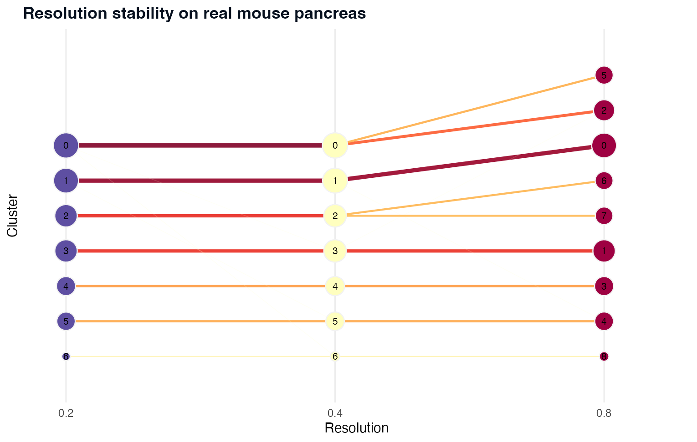
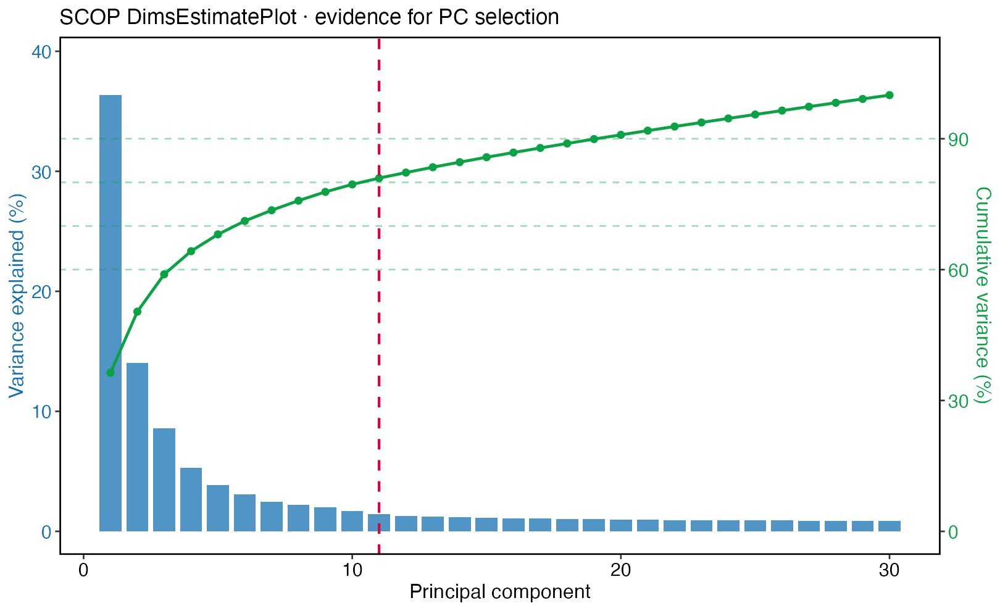
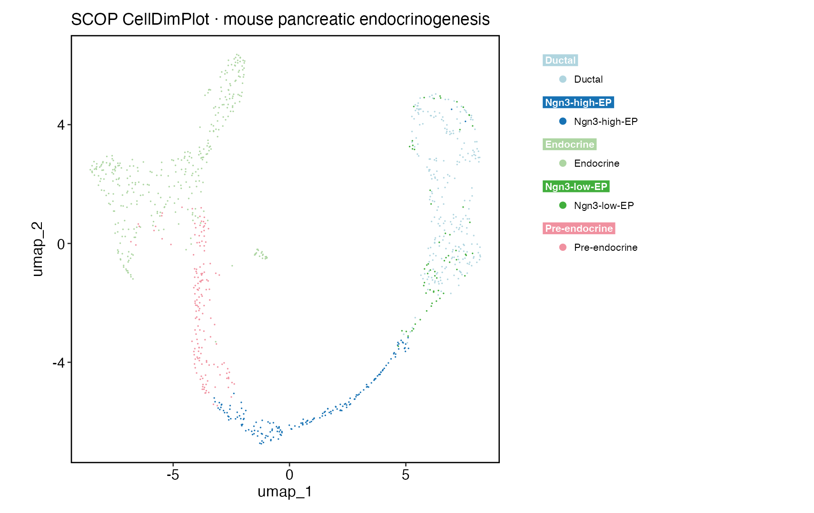

本章使用 `scop::pancreas_sub` 构建一个可以继续分析的真实对象。该小鼠胰腺发育子集包含 **15,998 个特征和 1,000 个细胞**，同时具有 RNA、spliced 和 unspliced assays。RNA assay 用于本章的构建流程；spliced/unspliced 为后续动态分析提供条件，但它们本身并不能证明真实谱系转换。

::: {.learning-objectives}
## 学习目标

完成本章后，你应该能够：

1. 在修改对象前完成结构审计；
2. 区分质控指标、双细胞、环境 RNA 与最终过滤决定；
3. 保存逐细胞排除原因，而不是直接无记录地 `subset()`；
4. 在正确的位置合并 Seurat v5 layers；
5. 用诊断证据选择 PC 数和聚类分辨率；
6. 使用 SCOP 原生绘图函数生成 QC、维度和 UMAP 图；
7. 保存可重启 checkpoint、结果表和证据文件。
:::

## 1 · 明确问题与输入合同

本章要回答的是：*这个真实对象能否通过透明、可复核的 QC 与聚类流程，并保留对象自带的胰腺发育细胞类别？* 本章不能回答：*这个教学子集是否发现了新的发育机制？*

::: {.input-contract}
**输入合同**

- 一个包含整数 RNA counts 的 Seurat 对象；
- feature 名和 cell barcode 不重复；
- 存在 `RNA`、`spliced`、`unspliced` assays；
- 自带 `CellType` 只用于内部一致性检查；
- 不默认旧 reduction 或旧 cluster 一定正确；
- seed 为 `20260807`，运行时为 R 4.5.1、SCOP 0.8.9、Seurat 5.5.0。
:::

```r
options(scop_env_init = FALSE)
library(scop)
library(Seurat)

set.seed(20260807)
data(pancreas_sub, package = "scop")
srt <- pancreas_sub
DefaultAssay(srt) <- "RNA"
```

处理前先审计：

```r
stopifnot(inherits(srt, "Seurat"))
stopifnot(!anyDuplicated(rownames(srt)), !anyDuplicated(colnames(srt)))

list(
  dimensions = dim(srt),
  assays = Assays(srt),
  layers = lapply(Assays(srt), function(a) Layers(srt[[a]])),
  reductions = Reductions(srt),
  graphs = Graphs(srt),
  metadata = colnames(srt[[]]),
  cell_types = table(srt$CellType)
)
```

先记录旧 reductions，再用明确的新名称保存重新计算的结果，避免覆盖后无法追溯。

## 2 · 先计算 QC 分布，再决定阈值

线粒体基因表达模式与物种、feature 命名有关。本对象使用小鼠模式 `^mt-`；很多人类对象使用 `^MT-`。

```r
srt[["percent.mt"]] <- PercentageFeatureSet(srt, pattern = "^mt-")
summary(srt$nFeature_RNA)
summary(srt$nCount_RNA)
summary(srt$percent.mt)
```

真实运行的中位数为：检测基因 **2,441**、UMI **6,190**、线粒体比例 **0.6943%**。这些数字描述本数据，不是通用阈值。

使用 SCOP 绘图：

```r
FeatureStatPlot(
  srt,
  stat.by = c("nFeature_RNA", "nCount_RNA", "percent.mt"),
  layer = "counts",
  plot_type = "violin",
  ncol = 3,
  legend.position = "none"
)
```

## 3 · 按样本识别双细胞

本案例验证的默认函数是 `db_scDblFinder()`。它需要原始 counts；在多样本研究中必须按样本运行。

```r
srt <- db_scDblFinder(
  srt,
  assay = "RNA",
  db_rate = 0.01,
  verbose = FALSE
)
table(srt$db.scDblFinder_class, useNA = "ifany")
```

真实运行识别出 **21 个 doublets**。SCOP 也提供统一入口：

```r
srt_alt <- RunDoubletCalling(
  srt,
  assay = "RNA",
  db_method = "scDblFinder",
  db_rate = 0.01
)
```

不要在看见结果后才规定“多个方法任一阳性就删除”。应比较得分分布、阳性数量、跨谱系 marker 组合以及删除后 cluster 是否稳定。

### 双细胞不等于环境 RNA

双细胞是一个液滴捕获多个细胞；环境 RNA 是游离 RNA 进入液滴。去除双细胞不能解决环境污染。在具备原始 counts 和合理 batch/background 时，可以考虑：

```r
srt_decont <- RunDecontX(
  srt,
  assay = "RNA",
  group.by = "CellType",
  assay_name = "decontXcounts",
  store_assay = TRUE,
  seed = 20260807
)
```

本章没有执行并发布 DecontX 结果。真正使用时要比较去污染前后的已知 marker、背景基因、counts 与生物结构，不能因为 UMAP 更“干净”就判断方法正确。

## 4 · 保存过滤规则和排除原因

```r
qc <- srt[[]]

reason <- data.frame(
  cell = rownames(qc),
  doublet = qc$db.scDblFinder_class != "singlet",
  low_features = qc$nFeature_RNA < 1000,
  high_features = qc$nFeature_RNA > 5000,
  high_mito = qc$percent.mt >= 5
)

reason$exclude <- with(
  reason,
  doublet | low_features | high_features | high_mito
)

colSums(reason[, c("doublet", "low_features", "high_features", "high_mito", "exclude")])
keep_cells <- reason$cell[!reason$exclude]
srt_filtered <- subset(srt, cells = keep_cells)
```

真实排除表：

| 原因 | 细胞数 |
|---|---:|
| scDblFinder doublet | 21 |
| 检测基因少于 1,000 | 0 |
| 检测基因多于 5,000 | 0 |
| 线粒体比例不低于 5% | 0 |
| 去重后的排除细胞 | 21 |
| 保留细胞 | **979/1,000（97.9%）** |

在其他数据中多个原因可能重叠，因此各原因之和不一定等于唯一排除细胞数。

{fig-alt="四个 SCOP 小提琴图比较真实小鼠胰腺细胞过滤前后的检测基因数和线粒体比例。"}

::: {.scop-native}
**SCOP 原生图片证据：**该图由 `scop::FeatureStatPlot()` 直接基于真实 `pancreas_sub` 对象生成，保存时没有使用其他绘图库重新绘制数据。Manifest 条目为 `single-qc.png`。
:::

## 5 · JoinLayers 与标准化选择

```r
srt <- JoinLayers(srt_filtered)
Layers(srt[["RNA"]])
```

本案例是单个干净样本，因此使用 log normalization：

```r
srt <- NormalizeData(srt, verbose = FALSE)
srt <- FindVariableFeatures(srt, nfeatures = 2000, verbose = FALSE)
srt <- ScaleData(srt, features = VariableFeatures(srt), verbose = FALSE)
srt <- RunPCA(srt, features = VariableFeatures(srt), npcs = 30, verbose = FALSE)
```

当研究设计适合 SCT 的深度模型和后续 SCT 流程时再使用 `SCTransform()`。不要因为 Harmony 可用，就给单样本强行做整合。

::: {.checkpoint}
**检查点 1——QC 完成对象**

确认 RNA counts/data layers、979 个细胞、唯一名称、doublet 列、排除原因表和 `CellType` 元数据都存在后，再保存对象。
:::

## 6 · 比较聚类分辨率

在同一个 neighbour graph 上测试多个分辨率：

```r
srt <- FindNeighbors(srt, dims = 1:20, verbose = FALSE)
srt <- FindClusters(
  srt,
  resolution = c(0.2, 0.4, 0.8),
  random.seed = 20260807,
  verbose = FALSE
)

cluster_cols <- grep("RNA_snn_res", colnames(srt[[]]), value = TRUE)

ClusterTreePlot(
  srt,
  cluster_cols = cluster_cols,
  title = "Resolution stability on real mouse pancreas"
)
```

{fig-alt="SCOP cluster tree 展示真实胰腺对象在三个分辨率下稳定或分裂的 clusters。"}

::: {.scop-native}
**SCOP 原生图片证据：**由 `scop::ClusterTreePlot()` 对过滤后的真实对象生成。0.4 分辨率得到 7 个 clusters，作为本案例可解释的中间选择。Cluster tree 只能展示分裂，不能自动决定“正确”分辨率。
:::

还要检查每个分辨率的 marker 一致性、最小 cluster 大小、doublet 富集、样本组成以及该分裂是否回答研究问题。

## 7 · 用证据选择 PC

```r
dims <- RunDimsEstimate(
  srt,
  reduction = "pca",
  method = "ensemble",
  min_dims = 5,
  verbose = FALSE
)

DimsEstimatePlot(
  srt,
  reduction = "pca",
  max_pcs = 30,
  title = "Evidence for PC selection"
)
```

真实运行选择 PC **1–11**。

{fig-alt="SCOP 维度诊断图展示解释方差柱、累计方差曲线和 PC 11 的选择线。"}

::: {.scop-native}
**SCOP 原生图片证据：**由 `scop::DimsEstimatePlot()` 从真实过滤对象的 PCA 生成。
:::

然后根据选定 PC 重新计算 UMAP：

```r
srt <- RunUMAP(
  srt,
  reduction = "pca",
  dims = seq_len(dims),
  reduction.name = "umap",
  seed.use = 20260807,
  verbose = FALSE
)

CellDimPlot(
  srt,
  group.by = "CellType",
  reduction = "umap",
  show_stat = FALSE,
  pt.size = 0.65,
  raster = FALSE
)
```

{fig-alt="SCOP UMAP 展示 ductal、endocrine、Ngn3-high、Ngn3-low 和 pre-endocrine 细胞。"}

::: {.scop-native}
**SCOP 原生图片证据：**由 `scop::CellDimPlot()` 从新生成的真实 UMAP 绘制。自带标签只用于内部检查，不是本次绘图重新发现的细胞类型。
:::

## 8 · Marker 与注释交接

```r
Idents(srt) <- srt$RNA_snn_res.0.4

markers <- scop::FindAllMarkers(
  srt,
  assay = "RNA",
  only.pos = TRUE,
  min.pct = 0.2,
  logfc.threshold = 0.25
)

markers <- markers[order(markers$p_val_adj, -markers$avg_log2FC), ]
top10 <- markers |>
  dplyr::group_by(cluster) |>
  dplyr::slice_min(p_val_adj, n = 10)
```

Marker 分析描述 cluster，不能替代患者层面的条件差异分析。结果表至少保存 cluster、gene、fold change、检测比例、校正 P 值、方法、assay、layer 和过滤参数。

把每个 cluster 映射到自带 `CellType` 多数标签后，细胞层面内部一致率为 **83.25%**。因为比较标签来自同一对象，这只是 concordance，不是独立验证。

## 9 · 保存可重启证据包

```r
dir.create("checkpoints", showWarnings = FALSE)
dir.create("results", showWarnings = FALSE)

saveRDS(srt, "checkpoints/03_clustered_pancreas.rds")
write.csv(reason, "results/qc-exclusion-reasons.csv", row.names = FALSE)
write.csv(markers, "results/cluster-markers.csv", row.names = FALSE)
writeLines(capture.output(sessionInfo()), "results/session-info.txt")
```

同时记录 checkpoint、marker 表和图片的 SHA-256。R 函数返回成功，并不等于保存结果可以被追溯和复现。

## 常见失败与决策

| 现象 | 先检查 | 下一步 |
|---|---|---|
| 几乎全部被判 doublet | 原始 counts、每样本细胞数、预期比例 | 按样本重跑并检查 backend 版本 |
| `percent.mt` 全是 0 | feature 命名大小写和物种 | 有依据地更改线粒体正则 |
| `JoinLayers()` 后没有 data layer | `Layers()` 输出 | 执行选定标准化，不能把 counts 当 normalized data |
| 0.8 才出现很小的 cluster | cluster tree、大小、marker、doublet | 没有独立证据时合并或保留 uncertain |
| 维度数明显异常 | PCA variance、reduction 名称 | 核对 reduction 并比较 scree/intrinsic 方法 |
| UMAP 每次不同 | seed、包版本、PC 数 | 锁定运行时，并优先比较 graph/marker 而不是像素位置 |

::: {.exercise}
## 练习

只改变一个决定：在相同细胞、PCA、neighbours 和 seed 上测试分辨率 0.6。报告：（a）cluster 数；（b）最小 cluster 大小；（c）哪个 0.4 cluster 被拆分；（d）子 cluster 是否有不同的正向和矛盾 marker。不能因为 UMAP 看起来更分离就选择 0.6。
:::

::: {.boundary}
**可以支持的结论：**真实对象经过有记录的 doublet/QC 流程后保留 979 个细胞，cluster tree 可解释，PC 11 有诊断依据，并恢复了对象自带的发育类别。**不能支持：**从该教学子集宣称新发育发现或患者层面推断。
:::
