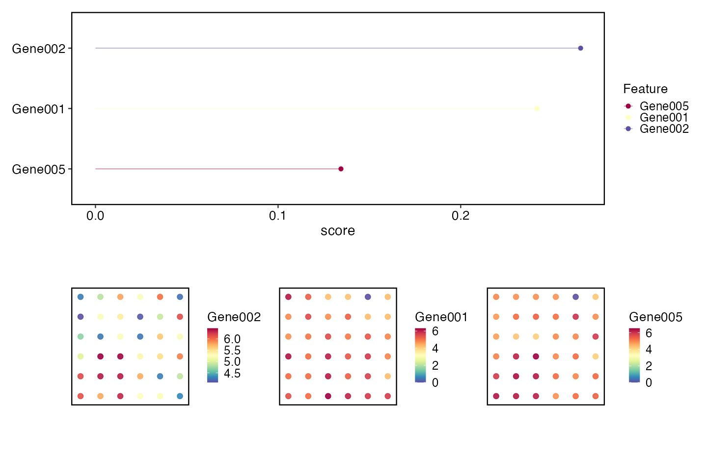

<span class="version-chip">已执行：SCOP 0.8.9 · R 4.5.1 · 合成网格</span>

## 生物学原理

空间分析把坐标加入表达矩阵。第一个问题不是“哪些 spot 看起来有趣”，而是“空间单位是什么、使用哪个坐标系、邻域定义是否可复现”。

## 输入契约

- 60 个基因 × 36 个 spot 的 6 × 6 合成网格。
- 坐标以 `col` 和 `row` 保存于对象 metadata。
- 一个 RNA assay，并为空间特征打分准备 normalized data。
- 不作组织诊断或临床解释。

## 工作流

```r
library(Seurat)
library(scop)

srt <- CreateSeuratObject(counts, project = "scop-learn-spatial")
srt$col <- col
srt$row <- row
srt <- NormalizeData(srt, verbose = FALSE)
srt <- RunSpatialVariableFeatures(srt, method = "moran", coord.cols = c("col", "row"), nfeatures = 10, min_spots = 5, verbose = FALSE)
srt <- RunSpatialNetwork(srt, method = "knn", coord.cols = c("col", "row"), k = 4, verbose = FALSE)
```

完整执行脚本在[仓库中](https://github.com/Carl6231/scop-learn/blob/main/scripts/spatial-case.R)。当前本地环境没有可选 `SpatialQM` 后端，因此页面不会把它假装成已执行证据。

{fig-alt="合成网格上的空间变异特征摘要" fig-cap="空间信号和 KNN 网络是合成网格的工作流证据，不是组织层面的生物学证据。"}

## 预期洞察

- 标准化对象保留全部 36 个 spot。
- 空间变异特征步骤返回与坐标列绑定的排序摘要。
- KNN 网络在对象 tools 中记录节点数、边数、活动图名称和参数。
- 证据清单明确报告可选后端限制。

## 解释边界

这里的空间关联是描述性的。合成网格不能证明组织区域、机制、细胞相互作用或临床结果。真实研究必须定义采样设计、坐标变换、邻域规则和重复单位。

## 审阅清单

- 确认坐标列和单位。
- 确认空间特征打分前已经完成标准化。
- 检查网络定义和边数。
- 说明哪些可选后端未安装或未执行。
- 将 spot-level 模式与 sample-level 推断分开。

[证据清单](../evidence/spatial-case.json) · [复现策略](reproducibility.html)
