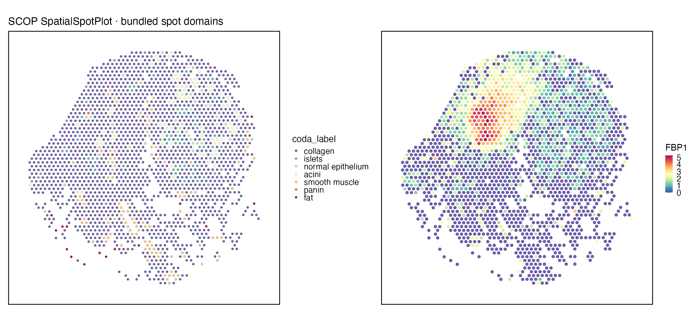
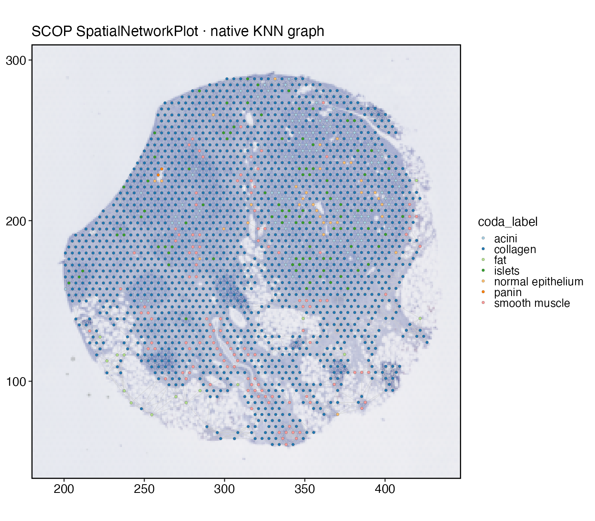
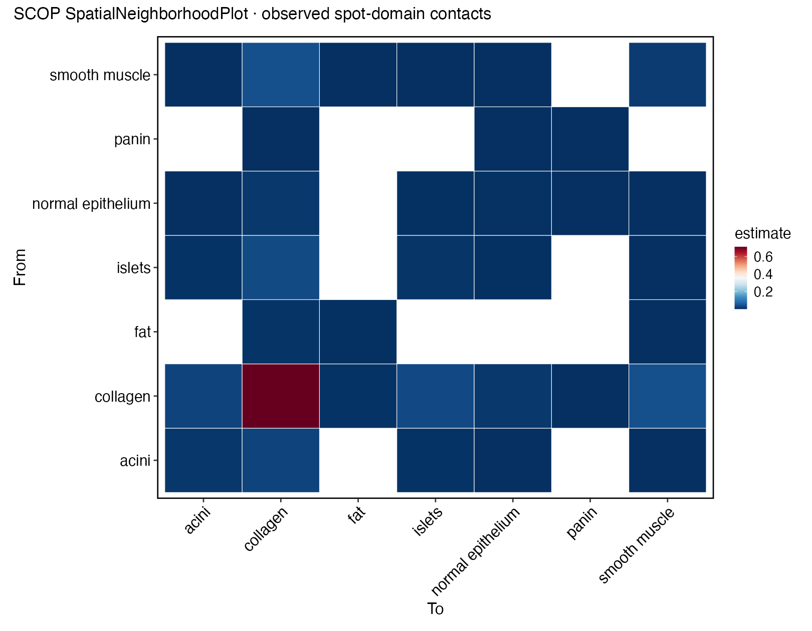
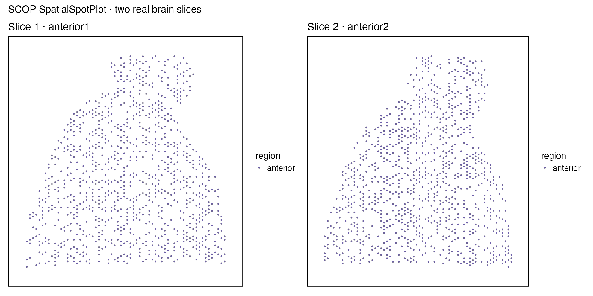

本章使用两个 SCOP 自带真实数据：GSM8058244 的 **1,986 个人 PanIN Visium spots**，以及两张小鼠脑切片共 **2,000 个 spots**。教学中始终区分三个证据层级：spot 测量、spot 组成估计、细胞分辨率推断，不能把三者写成同一种结论。

::: {.learning-objectives}
## 学习目标

你将学会：

1. 审计 assays、组织图像、spot barcodes 和坐标空间；
2. 运行并解释 spot QC，而不是复制通用阈值；
3. 用 SCOP 识别和绘制空间变异基因；
4. 构建并检查 SCOP 原生空间图；
5. 计算带标签 domain 的邻域关系；
6. 判断 RCTD、多切片整合或空间通信是否具备前提；
7. 分开描述 spot、组成和细胞层面的结论。
:::

## 1 · 读取对象并审计空间身份

::: {.input-contract}
**已执行人胰腺案例的输入合同**

- Seurat 对象：`visium_human_pancreas_sub`；
- 默认 assay：`Spatial`；
- image：`slice1`；
- 元数据坐标：`x`、`y`；
- 保留 `sample_id` 和自带 `coda_label`；
- 5,000 features × 1,986 spots；
- `coda_label` 是对象自带标签，不是本流程重新发现的 domain。
:::

```r
library(scop)
library(Seurat)

set.seed(20260807)
data(visium_human_pancreas_sub, package = "scop")
srt <- visium_human_pancreas_sub
DefaultAssay(srt) <- "Spatial"

list(
  dimensions = dim(srt),
  assays = Assays(srt),
  layers = Layers(srt[["Spatial"]]),
  images = Images(srt),
  metadata = colnames(srt[[]])
)
head(srt[[]][, c("x", "y", "sample_id", "coda_label")])
```

绘图前验证 barcode 与坐标：

```r
stopifnot(!anyDuplicated(colnames(srt)))
stopifnot(all(rownames(srt[[]]) == colnames(srt)))
stopifnot(all(is.finite(srt$x)), all(is.finite(srt$y)))
```

坐标可能是 Visium array 位置、全分辨率像素、低分辨率像素、微米或显示变换。本流程明确使用 `coord.cols = c("x", "y")`，所有函数保持同一坐标空间。

## 2 · Spot QC

```r
srt <- RunSpotQC(
  srt,
  assay = "Spatial",
  return_filtered = FALSE,
  qc_metrics = c("umi", "gene", "mito"),
  UMI_threshold = 0,
  gene_threshold = 0,
  mito_threshold = 100,
  seed = 20260807,
  verbose = FALSE
)
```

这些宽松值用于保留完整教学子集并生成 QC 字段，不是原始组织的推荐阈值。新切片至少检查：

- 每张切片的 UMI 和检测基因分布；
- 线粒体/应激高表达的边缘区域；
- tissue mask 与空白/background spots；
- 空间 dropout、折叠、撕裂和染色伪影；
- 每张切片和组织区域的保留 spots；
- 低 counts 区域是技术失败还是形态学真实结构。

数值分布可以用 `FeatureStatPlot()`；指标的空间位置可用 `SpatialSpotPlot(values = ...)` 或 features 参数。只有小提琴图会隐藏局部空间失败。

::: {.checkpoint}
**检查点 1——坐标与 QC 合同**

过滤前保存原始对象、选定坐标列、image 名、逐切片 QC 摘要、排除表和每个 QC 指标的空间图。
:::

## 3 · 标准化与空间变异基因

```r
srt <- NormalizeData(srt, assay = "Spatial", verbose = FALSE)

srt <- RunSpatialVariableFeatures(
  srt,
  assay = "Spatial",
  layer = "data",
  method = "moran",
  image = "slice1",
  coord.cols = c("x", "y"),
  k = 6,
  nfeatures = 100,
  min_spots = 10,
  store_results = TRUE,
  seed = 20260807,
  verbose = FALSE
)

top_moran <- head(VariableFeatures(srt), 20)
top_moran
```

真实 top features 包括 `FBP1`、`CELA3A`、`PNLIP`、`SPP1`、`CLPS`、`CTRC`、`PRSS1` 和 `COL1A1`。Moran 排名说明表达具有空间结构，不等于因果机制或细胞类型。

```r
SpatialSpotPlot(
  srt,
  group.by = "coda_label",
  image = "slice1",
  overlay_image = FALSE,
  coord.cols = c("x", "y")
)

SpatialVariableFeaturePlot(
  srt,
  plot_type = "surface",
  features = top_moran[1],
  assay = "Spatial",
  layer = "data",
  image = "slice1",
  overlay_image = FALSE,
  coord.cols = c("x", "y")
)
```

{fig-alt="SCOP SpatialSpotPlot 展示自带的人 PanIN spot domains，SCOP SpatialVariableFeaturePlot 展示 1,986 个真实 spots 上的 FBP1 表达。"}

::: {.scop-native}
**SCOP 原生图片证据：**左图由 `scop::SpatialSpotPlot()` 生成，右图由 `scop::SpatialVariableFeaturePlot()` 生成，两者使用同一真实对象与坐标空间，没有用原生 ggplot 重新绘制空间数据。
:::

多数 spots 的自带标签为 collagen，islet、acinar、smooth-muscle、fat、epithelial 和少量 PanIN 标签分布在更小区域。可以说 SCOP 展示了这些标签的空间排列，不能说本流程重新发现了这些 domains。

## 4 · 构建 SCOP 原生空间网络

```r
srt <- RunSpatialNetwork(
  srt,
  method = "knn",
  image = "slice1",
  coord.cols = c("x", "y"),
  k = 6,
  graph.name = "scop_knn",
  overwrite = TRUE,
  verbose = FALSE
)

SpatialNetworkPlot(
  object = srt,
  graph.name = "scop_knn",
  group.by = "coda_label",
  edge.linewidth = 0.15,
  pt.size = 1.2
)
```

{fig-alt="SCOP 空间网络图在真实人 PanIN 组织图像上叠加六近邻 graph 和自带 domain 标签。"}

::: {.scop-native}
**SCOP 原生图片证据：**由 `scop::SpatialNetworkPlot()` 绘制 `RunSpatialNetwork()` 存储的 graph。边只表示选定的几何邻域，不代表细胞通信。
:::

`k` 或 radius 应根据 spot 间距和技术选择。过多 edges 可能跨越组织空洞或边界，因此更密的 graph 不一定更好。

## 5 · 计算 domain 邻域关系

```r
srt <- RunSpatialNeighborhood(
  srt,
  group.by = "coda_label",
  method = "observed",
  image = "slice1",
  coord.cols = c("x", "y"),
  k = 6,
  tool_name = "SpatialNeighborhood",
  store_results = TRUE,
  verbose = FALSE
)

SpatialNeighborhoodPlot(
  srt,
  method = "observed",
  plot_type = "heatmap",
  top_n = 30
)
```

{fig-alt="SCOP heatmap 汇总 acini、collagen、fat、islet、normal epithelium、PanIN 和 smooth-muscle spot 标签之间的观察邻域。"}

::: {.scop-native}
**SCOP 原生图片证据：**由 `scop::SpatialNeighborhoodPlot()` 从 `RunSpatialNeighborhood(method = "observed")` 存储结果生成。
:::

单张组织上的结果只能描述性解释。比较条件时需要多个独立组织，保留 subject identity，并按方法设置 `sample.by`、`split.by` 或 `subject.by`。一张切片上的大量邻接 spots 不是大量患者。

## 6 · 去卷积决策

匹配单细胞参考存在、且 `spacexr` 可用时可考虑 RCTD：

```r
rctd <- RunRCTD(
  srt = srt,
  reference = reference,
  reference_label = "cell_type",
  assay = "Spatial",
  reference_assay = "RNA",
  layer = "counts",
  reference_layer = "counts",
  image = "slice1",
  coord.cols = c("x", "y"),
  rctd_mode = "full",
  max_cores = 4,
  store_results = TRUE
)

SpatialDeconvolutionPlot(rctd)
```

审计运行时缺少 `spacexr`，因此没有发布 RCTD 结果或去卷积图片。运行前必须核对物种、基因 ID、共有 genes、reference 细胞数、raw counts、细胞类型粒度与坐标单位。Domain 标签不能代替细胞组成估计。

## 7 · 多切片整合前审计

```r
data(visium_mouse_brain_slices_sub, package = "scop")
brain <- visium_mouse_brain_slices_sub

table(brain$slice)
Images(brain)
table(brain$region, brain$slice)
```

对象包含 `anterior1` 和 `anterior2`，每张 1,000 spots。多 image 对象必须显式指定 image：

```r
p1 <- SpatialSpotPlot(
  brain,
  group.by = "region",
  image = "anterior1",
  cells = Cells(brain[["anterior1"]]),
  overlay_image = FALSE
)

p2 <- SpatialSpotPlot(
  brain,
  group.by = "region",
  image = "anterior2",
  cells = Cells(brain[["anterior2"]]),
  overlay_image = FALSE
)
```

{fig-alt="两个 SCOP panel 分别展示一个真实矢状位前部小鼠脑 Visium 切片的 1,000 个 spots。"}

::: {.scop-native}
**SCOP 原生图片证据：**两幅图均由 `scop::SpatialSpotPlot()` 生成，并明确指定 image 和 cells。
:::

可能的整合调用：

```r
brain_integrated <- RunSpatialIntegration(
  brain,
  method = "PRECAST",
  sample.by = "slice",
  assay = "Spatial",
  layer = "counts",
  coord.cols = c("x", "y")
)

SpatialIntegrationPlot(brain_integrated)
```

本站没有声称这段已经执行。该子集只有粗略 `anterior` 标签，没有可用于验证精细空间生物结构保留的 region；只给一张整合图不足以证明成功。

## 8 · 空间通信决策

```r
spatial_chat <- RunSpatialCellChat(
  srt,
  group.by = "coda_label",
  sample.by = "sample_id",
  assay = "Spatial",
  layer = "data",
  image = "slice1",
  coord.cols = c("x", "y"),
  species = "Homo_sapiens",
  technology = "visium",
  analysis.level = "spot",
  nboot = 100,
  seed.use = 20260807
)
```

Spot 层结果是混合 spots 之间受空间约束的配体-受体共表达，不是一个已解析细胞类型向另一个细胞类型发送信号的直接证据。细胞类型通信需要去卷积或单细胞分辨技术、明确组成模型、多个独立组织和可运行后端。

## 9 · 输出与 checkpoint 合同

```r
saveRDS(srt, "checkpoints/05_spatial_pancreas.rds")
write.csv(
  GetSpatialResult(srt, method = "SpatialVariableFeatures"),
  "results/spatial-variable-features.csv",
  row.names = FALSE
)
writeLines(capture.output(sessionInfo()), "results/spatial-session-info.txt")
```

还要保存 image 名、坐标空间声明、spot 保留表、graph 参数、邻域结果、top features、可选后端状态、图片与哈希。

## 常见失败与停止规则

| 现象 | 检查证据 | 处理 |
|---|---|---|
| 组织上下镜像 | image 坐标、`flip.y`、坐标来源 | 选定一个空间并重建全部图 |
| graph 穿过空洞 | edge overlay、spot 间距、`k` | 减小 `k` 或改 radius neighbours |
| Moran top genes 全是高表达 housekeeping | library size 与表达普遍度 | 检查标准化并做敏感性分析 |
| RCTD 组成不合理 | 共有 genes、reference labels、物种、counts | 停止解释并修复 reference |
| 切片混合但已知 region 消失 | 整合前后 marker 与 region | 拒绝整合或缩小用途 |
| 一个 slide 驱动条件结果 | sample-level summary | 无独立组织时不能做条件推断 |

::: {.exercise}
## 练习

分别用 `k = 4` 和 `k = 10` 重建 graph，比较 edge 数、连通分量和前五个邻域 pairs。在阅读任何生物解释前，先判断哪个 graph 更符合组织几何结构。
:::

::: {.boundary}
**结论边界：**Moran features、graphs 和 neighbourhoods 可以支持 spot 层空间模式；不能单独证明细胞分辨率身份、物理信号传递、时间顺序或因果关系。
:::
